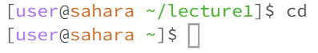
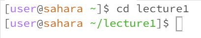
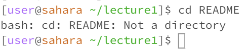
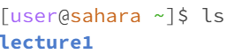
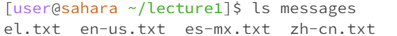
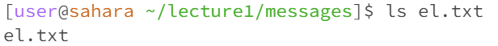
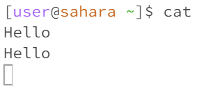
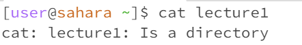

# Lab Report 1
 **`cd` command behaviors**
- no arguments

The working directory when running the `cd` command was `/home/lecture1`. The output of using the `cd` command without any arguments is that there's no output. However the terminal prompt changes so that the working directory is now `/home`. This is because `cd` stands for changing directory and since there were no arguments to specifically change the directory to, the home directory is the directory it uses to change to. This is why the command had no output and didn't create any errors.

- directory as an argument

The working directory when running the `cd` command was `/home`. The input was the `cd` command passing an argument of the directory `lecture1`. The ouput of this was nothing but the prompt in the terminal as you can see from the example has changed so that the working directory is now `/home/lecture1`. This happened because the `cd` command's function is to change the working directory and we gave a specific directory to change to through our argument. This scenario created no errors.

- file as an argument

The working directory when running the `cd` command was `/home/lecture1`. The input was the `cd` command passing an argument of the `README` file. The ouput of the command was an error message `bash: cd: README: Not a directory` and the prompt of the terminal after the command ran didn't change. The error message tells us that the README file isn't a directory because the `cd` command's function is to change the current directory with another directory which means the only valid arguments for this command to properly work are directories and not files.
 
 
 
**`ls` command behaviors**
- no arguments

The working directory when runnning the `ls` command was `/home`. The input in the terminal was the `ls` command with no arguments and the output was the folder `lecture1`. The reason why this happened is because since our working directory is `/home` and the `ls` command just lists the files and folders in a given path, it listed out `lecture1` as it was the only folder in the `/home` directory and there were no files in the working directory either. This scenario had no errors that were brought up in the output.

- directory as an argument

The working directory when running the `ls` command was `/home/lecture1`. The input in the terminal was the `ls` command passing in one argument of the directory called `messages` and the ouput was a list of txt files `el.txt`, `en-us.txt`, `es-mx.txt`, `zh-cn.txt`. The reason why this happened is because since our working directory had access to the `messages` folder, by passing in `messages` as an argument along with the `ls` command that lists files and folders of a certain path, we were able to list the files that can be found within the `messages` folder. The `messages` folder had no folders inside its contents and there were no errors due to this command.

- file as an argument

The working directory when running the `ls` command was `/home/lecture1/messages`. The input in the terminal was the `ls` command passing in one argument of the file called `el.txt` and the ouput was the same file that I passed in as an argument. The reason why this happened is because even though the directory had access to the file that I passed in as an argument, a file can't hold other files or folders so by calling the `ls` command on this file it could only list that file and nothing else. The `ls` command still ran with no errors.
 
 
 
**`cat` command behaviors**
- no arguments

The working directory when running the `cat` command was `/home`. The input in the terminal was the `cat` command with no argument and there was no ouput. However, after inputting the command, the terminal prompt is gone and instead, you're prompted to enter in an input and it will output an exact copy of your input. In the example picture above, the user input was `Hello` and the output just copied and printed the same user input. The reason why this happens is because the `cat` command's function is to print the contents of a file and I deduct that because there's no argument for a file to print the contents of, it just prompts you to input anything so that it can copy and print something hence its primary function. However, the behavior of this scenario doesn't cause any error messages to pop up as an output.

- directory as an argument

The working directory when running the `cat` command was `/home`. The input in the terminal was the `cat` command while passing the argument, `lecture1`, and the ouput was an error message. The message based on the example picture above, tells the user that `lecture1` is a directory and the reason it states this is because the `cat` command only takes in file arguments as its function is to print the contents of those files.

- file as an argument

The working directory when running the `cat` command was `home/lecture1/messages`. The input in the terminal was the `cat` command while passing the argument, `el.txt`, and the output printed the contents of the file `el.txt`. The reason why this happens is because the working directory has access to the contents of the `messages` folder and in that folder is the txt file `el.txt`. Since we call the `cat` command which has the function to print the contents of a file and we gave a valid and accessible file called `el.txt`, we were able to see the contents of that txt file through the output with no errors.
