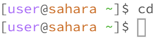
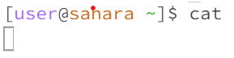

# Lab Report 1
## cd command behaviors
- no arguments

The working directory when running the `cd` command was `/home`. The output of using the `cd` command without any arguments in the current directory `/home` is that there's no output. However the `cd` command brings the path to the same directory than what it already was. This is because `cd` stands for changing directory and since there were no arguments, the default directory is the directory it uses to change to which is the directory we were in the first place. This is why it looks like the command effectively did nothing and didn't create any errors.

The working directory when running the `cd` command was `/home`. The input was the `cd` command with an argument of the directory `lecture1`. The ouput of this was nothing but the prompt in the terminal as you can see from the example, the prompt in the terminal has changed which means that the current directory the terminal is in has changed from `home` to `lecture1`. The output didn't create any error but the command instead just changed the current directory and showed no output.

The working directory when running the `cd` command with an argument was `/home/lecture1`. The input was the `cd` command with an argument of a `README` file. The ouput of the command was an error message `bash: cd: README: Not a directory` and the prompt of the terminal after the command ran didn't change. The error message tells us that the README file isn't a directory because the `cd` command's function is to change the current directory with another directory which means the only valid arguments for this command to properly work are directories and not files.

The working directory when runnning the `ls` command was `/home`. The input in the terminal was the `ls` command with no arguments and the output was the folder `lecture1`. The reason why this happened is because since our current directory is `/home` and the `ls` command just lists the files and folders in a given path, it listed out `lecture1` as it was the only folder in the `/home` directory and there were no files in the working directory either.

The working directory when running the `ls` command was `/home/lecture1`. The input in the terminal was the `ls` command with one argument which was a folder called `messages` and the ouput was a list of txt files. The reason why this happened was because since our current directory had access to the messages folder, by passing in `messages` as an argument along with the `ls` command that lists files and folders of a certain path, we were able to list the files that can be found within the messages folder.

The working directory when running the `ls` command was `/home/lecture1/messages`. The input in the terminal was `ls` command with one argument which was a file called 'el.txt' and the ouput was a list with the same file that I passed in as an argument. The reason why this happened is because even though the directory had access to the file that I passed in as an argument, a file can't hold other files or folders so by calling the `ls` command on this file it could only the list that we gave to the command.

The working directory when running the 'cat' command was `/home`. The input in the terminal was the 'cat' command with no argument and there was no ouput. However, after inputting the command, the terminal prompt is gone and instead, the terminal prompts you to enter another input and it will output an exact copy of your input. The reason why this happens is because the `cat` command's function is to print the contents of a file and I deduct that because there's no argument for a file to print the contents of, it just prompts you to input anything so that it can print something hence its primary function.

The working directory when running the `cat` was `/home/lecture1`. The input in the terminal was the 'cat' command with the argument, 'lecture1'. After running this command with an argument to a directory, the ouput was an error message. The message based on the example picture above, tells the user that `lecture1` is a directory and the reason the terminal states this is because the `cat` command only takes in file arguments as it prints the contents of those files.

The working directory when running the `cat` command was `home/lecture1/messages`. The input in the terminal was the `cat` command with the argument, `el.txt`. After running this command with an argument to a file, the output printed the contents of the file `el.txt`. The reason why this happens is because the current directory the terminal is in is in the messages directory and because of this, we have access to the directory's files which includes the txt file `el.txt`. Since we call the `cat` command which function is to print the contents of a file and we gave a valid and accessible file called `el.txt`, we were able to see the contents of that txt file in the terminal.
