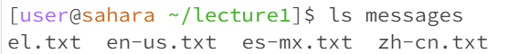

This is my lab report
When will I do it?
Idk but I'll definitely do it
What day?
Today's Thursday
soooooooo
we got
Friday
Saturday
Sunday
Monday
Tuesday
that's 5 days!
Let me give a guess
ummmm
Monday
cuz its a holiday
cool

The working directory when running the `cd` command was `/home`. The output of using the `cd` command without any arguments in the current directory `/home` is that there's no output. However the `cd` command brings the path to the same directory than what it already was. This is because `cd` stands for changing directory and since there were no arguments, the default directory is the directory it uses to change to which is the directory we were in the first place. This is why it looks like the command effectively did nothing and didn't create any errors.

The working directory when running the `cd` command with an argument of a folder was `/home`. The input was the `cd` command with an argument of the directory `lecture1`. The ouput of this was nothing but the prompt in the terminal as you can see from the example, the prompt in the terminal has changed which means that the current directory the terminal is in has changed from `home` to `lecture1`. The output didn't create any error but the command instead just changed the current directory and showed no output.

The working directory when running the `cd` command with an argument of a file was `lecture1`. The input wwas the `cd` command with an argument of a `README` file. The ouput of the command was the printed message `bash: cd: README: Not a directory` and the prompt of the terminal after the command ran didn't change. The message is an error message that tells us that the README file isn't a directory because the `cd` command's function is to change the current directory with another directory which means the only valid arguments for this command to properly work are directories and not files.

The working directory when running the `ls` command with an 

