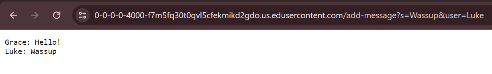

# Lab Report 2
## Part 1

- The methods that are called are `getPath()` to get the current path of the url and then the method `equals()` or `contains()` is called on top of that to compare if the path matches with any cases that would cause a change in the server from the code. In this instance, the method `getQuery()` is called to get the query of the url and then the method `split()` is called on top of that to split the query into an Array called `parameters`. The `split()` method is also used to split one of the elements in the Array `parameters` into its own Array called `split`. The `equals()` method is also used for comparing elements in the Arrays in order to assign values to specific fields. Since my implementation of the code also uses an ArrayList, I use the `add()` method to record each output of the web server and also the `get()` and `size()` methods to access information about the ArrayList. The `String.format()` method is also used to format a String that will be the output on the web page after the web request is made.
- A relevant argument of one of the `equals()` methods is the String, `"/"` which is one of the paths and another argument that is used on the `contains()` method for another valid path is `"add-messages"`. The `split()` method uses the String argument `"="` to split the query and another String argument `"&"` to split one of the elements in the Array `parameters`. The `equals()` method is used to compare elements in the Arrays to the String arguments of `"s"` and `"user"`. The `get()` starts with an int argument `0` to access the first element of the ArrayList but a for loop is eventually used so it can iterate through all the elements in the ArrayList. There are 3 parameters for the method `String.format()` which are the format of the String `"%s: %s"` in which the two `%s` are supposed to be placeholders for two different Strings, the first String which is the field `user` that holds the value `"Grace"`, and the second String which is the field `userMessage` that holds the value `"Hello!"`. Before the web request was made, the ArrayList `chat` was originally empty, the String field `userMessage` was originally not initialized, the String field `user` was also originally not initialized, and another String field `chatBlock` held the first element of the Arraylist concatenated with a line space.
- Some of the values from fields that have changed after this specific request is the String field `userMessage` which started from not being initialized to being initialized to the value `"Hello!"` and another String field `user` which also started from not being initialized to being initialized to the value `"Grace"`. The ArrayList `chat` now has one element which is the String `"Grace: Hello!"`. The String field `chatBlock` value didn't change and it still holds the first element of the ArrayList `chat` concatenated with a line space because the for loop didn't need to iterate through the ArrayList `chat` since all its elements were already concatenated to `chatBlock`.

- The methods that are called are `getPath()` to get the current path of the url and then the method `equals()` or `contains()` is called on top of that to compare if the path matches with any cases that would cause a change in the server from the code. In this instance, the method `getQuery()` is called to get the query of the url and then the method `split()` is called on top of that to split the query into an Array called `parameters`. The `split()` method is also used to split one of the elements in the Array `parameters` into its own Array called `split`. The `equals()` method is also used for comparing elements in the Arrays in order to assign values to specific fields. Since my implementation of the code also uses an ArrayList, I use the `add()` method to record each output of the web server and also the `get()` and `size()` methods to access information about the ArrayList. The `String.format()` method is also used to format a String that will be the output on the web page after the web request is made.
- A relevant argument of one of the `equals()` methods is the String, `"/"` which is one of the paths and another argument that is used on the `contains()` method for another valid path is `"add-messages"`. The `split()` method uses the String argument `"="` to split the query and another String argument `"&"` to split one of the elements in the Array `parameters`. The `equals()` method when used to compare elements in the Arrays to the String arguments of `"s"` and `"user"`. The `get()` starts with 0 to access the first element of the ArrayList but a for loop is used so it can iterate through all the elements in the ArrayList. There are 3 parameters for the method `String.format()` which are the format of the String `"%s: %s"` in which the two `%s` are supposed to be placeholders for two different Strings, the first String which is the String field `user` that holds the value `"Luke"`, and the second String which is the field `userMessage` that holds the value `"Wassup"`. Before this web request was made, some relevant fields were the ArrayList `chat` that had one element which was a String `"Grace: Hello!"`, the String field `userMessage` which had the value `"Hello!"`, the String field `user` which had the value `"Grace"`, and another String field `chatBlock` which held the first element of the Arraylist concatenated with a line space.
- Some of the values from fields that have changed after this specific request is the String field `userMessage` with the value `"Wassup"` and another String field `user` with the value `"Luke"`. The ArrayList `chat` now has two elements, the first element being the String "Grace: Hello!", and the second element being the String `"Luke: Wassup"`. The String field `chatBlock` holds the first element of the ArrayList `chat` concatenated with a line space concatenated with the second element of the ArrayList `chat` and finally concatenated with another line space.

## Part 2

- Private Key
  

- Public Key

- Doesn't ask for password

## Part 3

Something I learned in lab from week 3 that I didn't know about beforehand was how a web server worked from behind the scenes. I knew a little bit that you could change the url to change something on the page but I didn't know what was actually being typed into the url and what parts of the url even meant. Through lab from week 2, not only did I learn to build and run my own server, I was able to look at the code that helped create valid paths for the url. This cleared up a lot of confusion on what certain parts of the url do if I were to change it. In improving my own understanding of how a server works along with some example code, I was able to structure a new web server that was different than the example given in lab.

