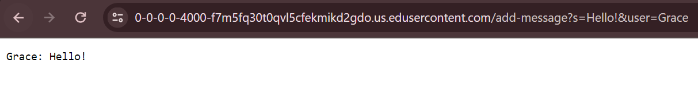

# Lab Report 2
## Part 1

- The methods that are called are `url.getPath()` to get the current path which is called on the method `.equals()` or `.contains()` to compare if the path matches with any cases that would cause a change in the server from the code. In this instance, the method `.getQuery()` is called to get the query of the url which is called on the method `.split()` to split the query into an Array called `parameters`. The `.split()` method is also used to split one of the elements in the Array `parameters` into its own Array called `split`. The `.equals()` method is also used for comparing elements in the Arrays in order to assign values to specific fields. Since my implementation of the code also uses an ArrayList, I use the `.add()` method to record each output of the web server and also the `.get()` and `.size()` methods to access information about the ArrayList.
- The relevant arguments of one of the `.equals()` methods is the String, `"/"` which is one of the paths and the other argument which is used on the `.contains()` method for another valid path is `"add-messages"`. The `.split()` method uses the String argument `"="` to split the query and another String argument `"&"` to split one of the elements in the Array `parameters`. The `.equals()` method when used to compare elements in the Arrays to the String arguments of `"s"` and '"user"'. The `.get()` starts with 0 to access the first element of the ArrayList but a for loop is used so it can iterate through all the elements in the ArrayList.
- Some of the values from fields that have changed after this specific request is the String field `userMessage` which started from not being initialized to initializing to the value `"Hello!"` and another String field `user` which also started from not being initialized to being initialized to the value `"Grace"`.

- The methods that are called are `url.getPath()` to get the current path which is called on the method `.equals()` or `.contains()` to compare if the path matches with any cases that would cause a change in the server from the code. In this instance, the method `.getQuery()` is called to get the query of the url which is called on the method `.split()` to split the query into an Array called `parameters`. The `.split()` method is also used to split one of the elements in the Array `parameters` into its own Array called `split`. The `.equals()` method is also used for comparing elements in the Arrays in order to assign values to specific fields. Since my implementation of the code also uses an ArrayList, I use the `.add()` method to record each output of the web server and also the `.get()` and `.size()` methods to access information about the ArrayList.
- The relevant arguments of one of the `.equals()` methods is the String, `"/"` which is one of the paths and the other argument which is used on the `.contains()` method for another valid path is `"add-messages"`. The `.split()` method uses the String argument `"="` to split the query and another String argument `"&"` to split one of the elements in the Array `parameters`. The `.equals()` method when used to compare elements in the Arrays to the String arguments of `"s"` and '"user"'. The `.get()` starts with 0 to access the first element of the ArrayList but a for loop is used so it can iterate through all the elements in the ArrayList.
- Some of the values from fields that have changed after this specific request is the String field `userMessage` which started from not being initialized to initializing to the value `"Wassup"` and another String field `user` which also started from not being initialized to being initialized to the value `"Luke"`.

## Part 2

- Private Key
  

-Public Key

-Doesn't ask for password

## Part 3

Something I learned in lab from week 3 that I didn't know about beforehand was how a web server works from behind the scenes. I knew a little bit that you could change the url to change something on the page but I didn't know what was actually being typed in the url and what parts of the url even mean. Through lab from week 2, not only did I learn to build and run my own server, I was able to look at the code that helps create valid paths of the url which helped clear up a lot of confusion on what parts of the url do if I were to change it. In understanding the behind the scenes of how a server works along with some example code, I was able to structure a new web server that was different than the example given in lab.

