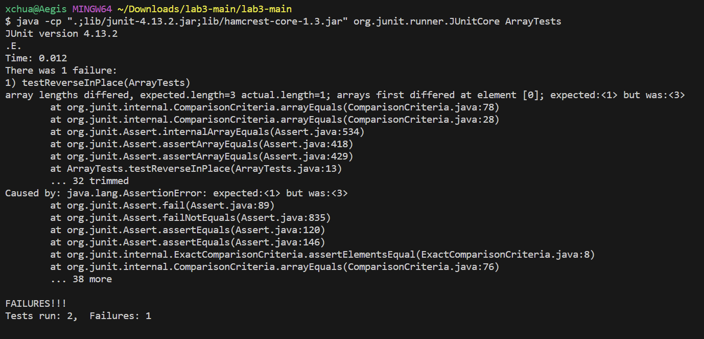
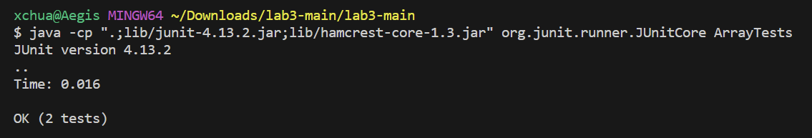

# Lap Report 3
## Part 1
Failure inducing input
```
int[] input2 = { 3, 2, 1 };
ArrayExamples.reverseInPlace(input1);
assertArrayEquals(new int[]{ 1, 2, 3 }, input1);
```
Output of above input

Input that doesn't induce failure
```
int[] input1 = { 3 };
ArrayExamples.reverseInPlace(input1);
assertArrayEquals(new int[]{ 3 }, input1);
```
Output of above input

Code before fix
```
static void reverseInPlace(int[] arr) {
    for(int i = 0; i < arr.length; i += 1) {
        arr[i] = arr[arr.length - i - 1];
    }
}
```
Code after fix
```
static void reverseInPlace(int[] arr) {
    int[] newArr = new int[arr.length];
    for(int i = 0; i < arr.length; i += 1) {
        newArr[i] = arr[arr.length - i - 1];
    }
    for(int j = 0; j < arr.length; j += 1) {
        arr[j] = newArr[j];
    }
}
```
The issue that the original code had was that since we updated the Array at the same time that we're iterating through its elements, some of the elements are overriden before we have the chance to access them which means we lose that value. The new code fixes the issue by creating another Array that is used to hold the elements of the array `arr` in reverse so that we can access all the elements that were originally in the Array without them being changed in the process. 
## Part 2
Using the command `less -N`
```
less -N find-biomed.txt

      1 biomed/
      2 biomed/1468-6708-3-1.txt
      3 biomed/1468-6708-3-10.txt
      4 biomed/1468-6708-3-3.txt
      5 biomed/1468-6708-3-4.txt
      6 biomed/1468-6708-3-7.txt
      7 biomed/1471-2091-2-10.txt
      8 biomed/1471-2091-2-11.txt
      9 biomed/1471-2091-2-12.txt
     10 biomed/1471-2091-2-13.txt
     11 biomed/1471-2091-2-16.txt
find-biomed.txt
```
```
less -N biomed/1471-2091-3-15.txt

      1
      2
      3
      4
      5         Background
      6         Sequence homology between the serotonin type 3 receptor
      7         (5-HT
      8         3 R), the nicotinic acetylcholine
      9         receptor (nAChR), the GABA
     10         A receptor and the glycine receptor
     11         suggests a large amount of structural similarity within
biomed/1471-2091-3-15.txt
```
What this command is doing is it displays line numbers for each line that's displayed on the output. In the first code block, it's adding line numbers to the file `find-biomed.txt` which was created based on the directory `biomed` that holds `txt` files. The second code block adds number lines to a txt file within the `biomed` directory. While this may not be the most common way of finding out how many lines there are in a file, it helps keep track of just how many there are when you're searching and browsing the entire file.

Source: https://ioflood.com/blog/less-linux-command/

Using the command `less -p`
```
less -p "3-19" find-biomed.txt

biomed/1471-2121-3-19.txt
biomed/1471-2121-3-2.txt
biomed/1471-2121-3-21.txt
biomed/1471-2121-3-22.txt
biomed/1471-2121-3-25.txt
biomed/1471-2121-3-30.txt
biomed/1471-2121-3-4.txt
biomed/1471-2121-3-6.txt
biomed/1471-2121-3-8.txt
biomed/1471-2121-4-1.txt
biomed/1471-2121-4-2.txt
find-biomed.txt
```
```
less -p "paper" biomed/1468-6708-3-1.txt

        events [ 10 ] . In this paper we study whether BMI at
        baseline is associated with living longer, and/or with more
        years of being healthy, in a cohort of older adults for
        whom risk factors, subclinical disease, and morbidity are
        well characterized. The goal is to determine whether
        analyses based on years of life (YOL) or on YHL would
        provide substantively different results, and which measure
        would yield more powerful evaluations of weight
        modification interventions in older adults.


biomed/1468-6708-3-1.txt
```
What this command does is it starts the output at the first occurrence of a specific pattern. In the first code block, it's using `less` on the file `find-biomed.txt` which is based on the directory `biomed` that holds txt files. The pattern that it's trying to find is the String `"3-19"` which matches one of the txt files and so the file that matches with the pattern first is the first line that's shown in the output. The second code block is using `less` on a `txt` file in the biomed directory called `1468-6708-3-1.txt` and it's checking for the pattern `"paper"` to match with one of the words in the txt file so the output can start at the line where that word is found. This command is useful because it helps search for a specific pattern that you want to see from the start using the terminal prompt rather than searching for it after you start browsing.

Using the command `less -M`
```
less -M find-plos.txt

plos/
plos/journal.pbio.0020001.txt
plos/journal.pbio.0020010.txt
plos/journal.pbio.0020012.txt
plos/journal.pbio.0020013.txt
plos/journal.pbio.0020019.txt
plos/journal.pbio.0020028.txt
plos/journal.pbio.0020035.txt
plos/journal.pbio.0020040.txt
plos/journal.pbio.0020042.txt
plos/journal.pbio.0020043.txt
plos/journal.pbio.0020046.txt
find-plos.txt lines 1-12/253 5%
```
```
less -M plos/journal.pbio.0020046.txt

        Stuttering, with its characteristic disruption in verbal fluency, has been known for
        centuries; earliest descriptions probably date back to the Biblical Moses' “slowness of
        speech and tongue” and his related avoidance behavior (Exodus 4, 10–13). Stuttering occurs
        in all cultures and ethnic groups (Andrews et al. 1983; Zimmermann et al. 1983), although
        prevalence might differ. Insofar as many of the steps in how we produce language normally
        are still a mystery, disorders like stuttering are even more poorly understood. However,
        genetic and neurobiological approaches are now giving us clues to causes and better
plos/journal.pbio.0020046.txt lines 1-12/232 4%
```
What this command does is it shows a more complex prompt that holds information about the contents of the file we're browsing. In the first code block, we use the `less` command on the file `find-plos.txt` which is based off of the `plos` directory that holds many txt files. At the end of this code block, we can see that instead of the prompt just showing the path of the file like usual, in addition, it's showing that we're looking at lines 1-12 out of 253 lines in the file, and that we have only browsed 5% of the entire file. In the second code block we're directly accessing a file in the directory `plos` called `journal.pbio.0020046.txt` and the prompt is telling us that we're currently browsing lines 1-12 out of the 232 lines in the file and that we've only browsed 4% of the entire file. This information gets updated every time we page up or page down. This is useful because we can understand how much we've actually browsed through since looking at many files that look very similar is very hard to keep track of which this command helps with as it accurately displays browsing information.

Using the command `less -F`
```
less -F  find-AlcoholProblems.txt
government/Alcohol_Problems/
government/Alcohol_Problems/DraftRecom-PDF.txt
government/Alcohol_Problems/Session2-PDF.txt
government/Alcohol_Problems/Session3-PDF.txt
government/Alcohol_Problems/Session4-PDF.txt

xchua@Aegis MINGW64 ~/Documents/Github/docsearch/technical (main)
```
```
less -F plos/pmed.0020191.txt


        The excellent article by Jordan Paradise, Lori B. Andrews, and colleagues, “Ethics.
        Constructing Ethical Guidelines for Biohistory” [1], neither advocates nor argues against
        biohistorical research; instead, it points out that such investigations are currently
        taking place without guidelines—ethical, scientific, moral, or religious. The question
        remains: if such guidelines were to be established, what individuals, institutions,
        governments, medical examiners, family members, or intrepid biographers are to be given
        permission? Who is to decide what is “historically significant”? Not to mention the
        meta-question: who is to decide who is to decide? I apologize to the authors if my brief
        comments [2] implied that they took a position on this issue.


xchua@Aegis MINGW64 ~/Documents/Github/docsearch/technical (main)
```
What this command does is if the content of the file can be displayed on one page, it will automatically exit out of the command. In the first code block, we use the `less` command on the file `find-AlcoholProblems.txt` which is based off of the `Alcohol_Problems` directory that holds `txt` files. Since the amount of txt files in the directory can fit on one page, we can see that it automatically exits out of the command and back to the terminal prompt. In the second code block, we're directly using the `less` command on a txt file in the directory `plos` called `pmed.0020191.txt` which its contents can also fit on one page. As you can see the command exits automatically and goes back to the terminal prompt at the end. A behavior that should be noted as well is that because it automatically exits the command for us, we can still see the contents that we were browsing rather than if we used the normal `less` command and the user would have to exit out of the command which would close the contents unless we used the `less` command again.
