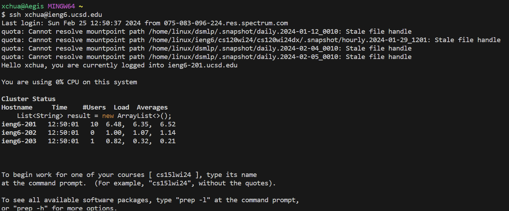
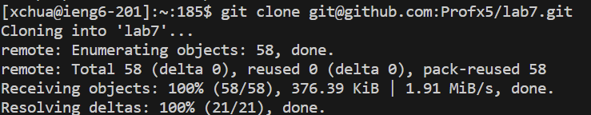
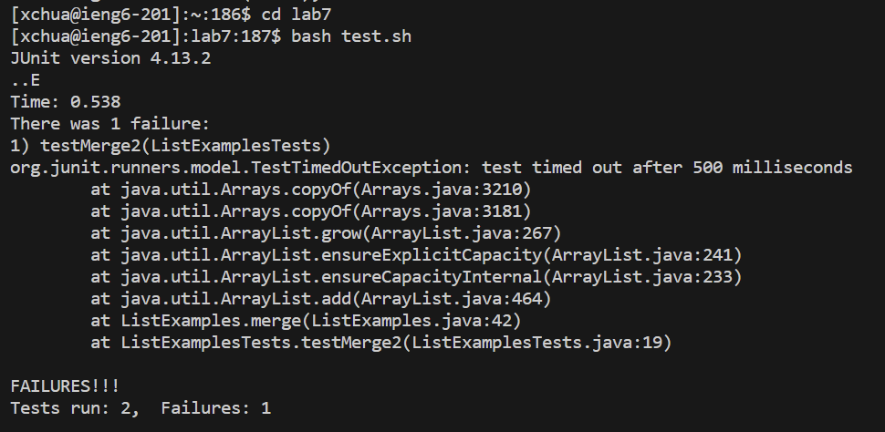
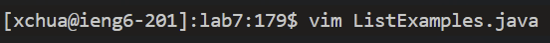
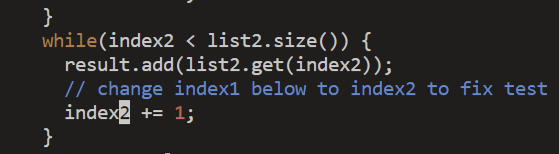
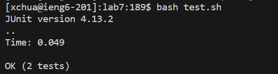
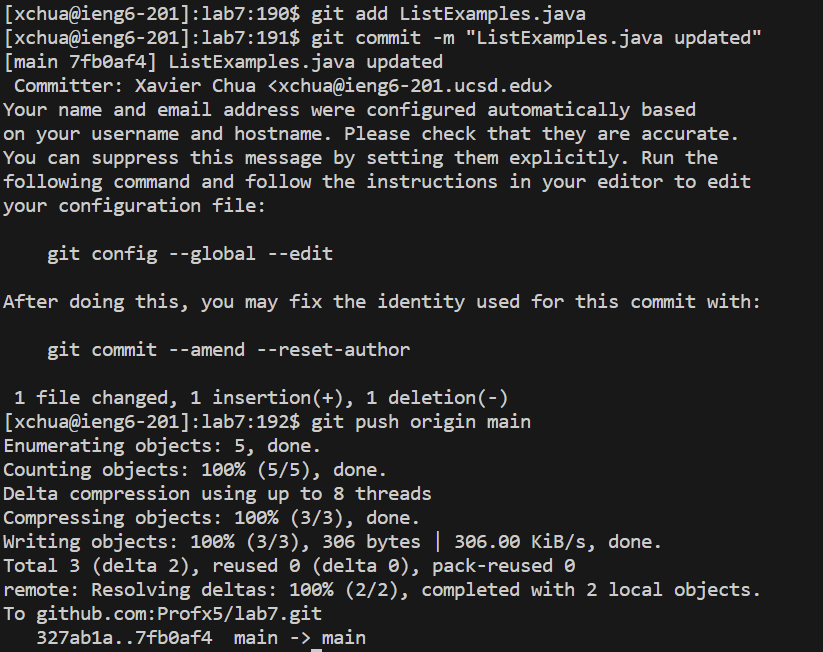

# Lab 4
## Step 4

Keys Pressed: `<up> <enter>`. I used one up arrow to access my `ssh xchua@ieng6.ucsd.edu` command from my search history.

## Step 5

Keys Pressed: `<up> <up> <up> <up> <up> <up> <up> <up> <up> <enter>`. I used 9 up arrows to access the command `git clone git@github.com:Profx5/lab7.git` from my search history.

## Step 6

Keys Pressed: `<up> <up> <up> <up> <up> <up> <up> <up> <up> <enter>, <up> <up> <up> <up> <up> <up> <up> <enter>`. I also used my search history to access the command `cd lab7` using 9 up arrows and then the `bash test.sh` command using 7 up arrows.

## Step 7

Keys Pressed: `<up> <up> <up> <up> <up> <up> <up> <up> <up> <enter>` I used 9 up arrows to access the command `vim ListExamples.java` from my search history.

Keys Pressed: `<x> <i> <2> <esc> and :wq`. Since my cursor was already at the location I needed to fix in the java file, I didn't have to move the cursor. I used `x` to delete the character 1 then at the exact location I pressed `i` to enter insert mode. I inserted the character `2` to replace the `1` and then I pressed escape to exit out of insert mode. To save my changes I pressed :wq.

## Step 8

Keys Pressed: `<up> <up> <enter>`. I used 2 up arrows to access `bash test.sh` again so I could check if all tests were successful.

## Step 9

Keys Pressed: `<up> <up> <up> <up> <up> <up> <up> <up> <up> <enter> <up> <up> <up> <up> <up> <up> <up> <up> <up> <enter> <up> <up> <up> <up> <up> <up> <up> <up> <up> <enter>`. I used 9 up arrows to access `git add ListExamples.java` which added ListExamples.java as one of the files I want to commit and push to Github and then another 9 up arrows to access `git commit -m "ListExamples.java updated"` which commits the checked files and then finally another 9 up arrows to access `git push origin main` which pushes my changes to Github.
