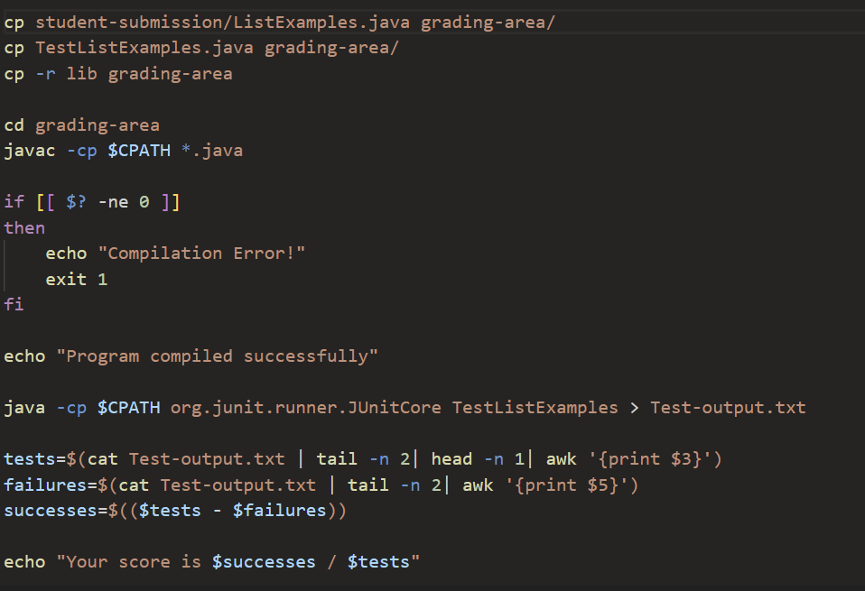

# Lab 5
## Part 1
### Student Edstem submission
Hello! I'm having some problems with the grading bash script, more specifically the case in which the test grader should output a message when the tests compile but some of the tests have failed. In the terminal, I use the command `bash grade.sh` with the repository `https://github.com/ucsd-cse15l-f22/list-methods-lab3` which has tests that fail. The bash script will change the home directory into the `grading-area` directory and will run the tests in the file `TestListExamples.java` from there. What I expected in the output was the formatted string "Your score is 0/1" with the first number being the tests that have succeeded and the second number being the tests that ran. However, as we can see from the screenshot, the score says `-1/1,`. What's interesting to me is that there's a comma in the score even though the variable I accessed from the JUnit Test is techinically the right number. In addition, the first number is a negative number which can't be true since we can't have a negative number of tests that succeeded. One thing I'm considering is the fact that the comma that's next to the 1 isn't considered a number and since I'm doing operations on this value in the bash script, then I'm guessing that value is defaulted to 0. However, I'm not sure why I have a comma next to the 1 in the first place? Maybe it's because the last line has more words than I expected which means I'm looking at the wrong field?

### TA feedback
Hello! From your submission, it seems like you're definitely heading in the right direction. Can you take a second look at the format of the JUnit test output in the last line? It seems you've piped the output into a txt file called `TestListOutput.txt` so you can check the output from there. Also, it's good to know that when you're printing a specific field of the last line of output, a field is separated by spaces so any characters that are right next to each other will be part of one field until the next space. If you want to separate the fields based on a certain character you want, you can use the `awk -F'[pattern]'` command in which the pattern you want will separate the fields.

### Student callback
Thank you for the feedback, I realized that by checking the actual JUnit test output, I realized that `1,` is it's own field so in order to separate I used the `awk -F` command that you recommended. Since I want to get rid of the comma I should have the pattern of the field seperator as [, ] and it worked like I originally expected :) It's now clear to me that the bug was the awk command in my `tests` variable in which I didn't fully understand the logic of what the awk command does. Now I know the default behavior of how awk separates fields and the command that I can use to make my own custom field separators.

