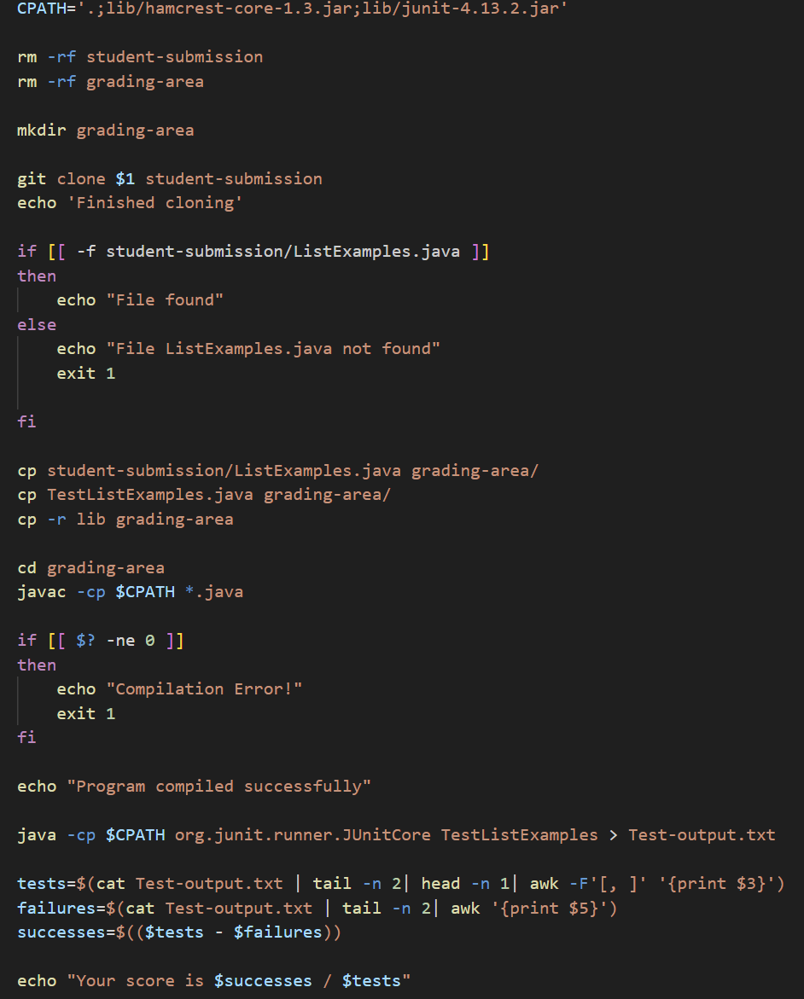

# Lab 5
## Part 1
### Student Edstem submission
Hello! I'm having some problems with the grading bash script, more specifically the case in which the test grader should output a message when the tests compile but some of the tests have failed. In the terminal, I use the command `bash grade.sh` with the repository `https://github.com/ucsd-cse15l-f22/list-methods-lab3` which has tests that fail. The bash script will change the home directory into the `grading-area` directory and will run the tests in the file `TestListExamples.java` from there. The full directory structure is in the pictures below. What I expected in the output was the formatted string "Your score is 0/1" with the first number being the tests that have succeeded which is a variable in the bash script called `successes` and the second number being the tests that ran which is a variable in the bash script called `tests`. However, as we can see from the screenshot, the score says `-1/1,`. What's interesting to me is that there's a comma in the score even though the variable I accessed from the JUnit Test is techinically the right number. In addition, the first number is a negative number which can't be true since we can't have a negative number of tests that succeeded. One thing I'm considering is the fact that the comma that's next to the 1 isn't considered a number and since I'm doing operations on variables to get the variable `successes` in the bash script, then I'm guessing the value of `tests` is defaulted to 0. However, I'm not sure why I have a comma next to the 1 in the first place? Maybe it's because the last line has more words than I expected which means I'm looking at the wrong field?

### TA feedback
Hello! From your submission, it seems like you're definitely heading in the right direction. Can you take a second look at the format of the JUnit test output in the last line? It seems you've piped the output into a txt file called `Test-output.txt` so you can check the output from there. Also, it's good to know that when you're printing a specific field in the last line of output, by default, a field is separated by spaces so any characters that are right next to each other will be part of one field. If you want to separate the fields based on a certain character, you can use the `awk -F'[pattern]'` command in which the pattern you want will separate the fields.

### Student callback
Thank you for the feedback, I realized that by checking the actual JUnit test output, `1,` is its own field so in order to separate I used the `awk -F` command that you recommended. Since I want to get rid of the comma I should have the pattern of the field seperator as [, ] and it worked like I originally expected :) It's now clear to me that the bug was the awk command in my `tests` variable in which I didn't fully understand the logic of what the awk command does. Now I know the default behavior of how awk separates fields and the command that I can use to make my own custom field separators.

## Part 2
Something I learned from my lab experience in the second half of this quarter that I didn't know before was learning about Vim and how I can use it in my own daily coding use. Before learning it in class, I never really understood what the term actually met and it was definitely one of the more common words I hear when listening in on other classmates in my computer science lectures. Now that I know that Vim is a text editor, its functionality makes so much more sense since I've been using my mouse on VScode to enter and edit all my files. While I've only just learned about how to use it, over the past weeks I've been getting a lot more comfortable using vim and using the terminal in general to edit files and access files rather than just using a terminal to look at output. I can see this being an important tool in the future for my other coding classes and I want to learn more about Vim as my current workflow when coding works better when using Vim.

